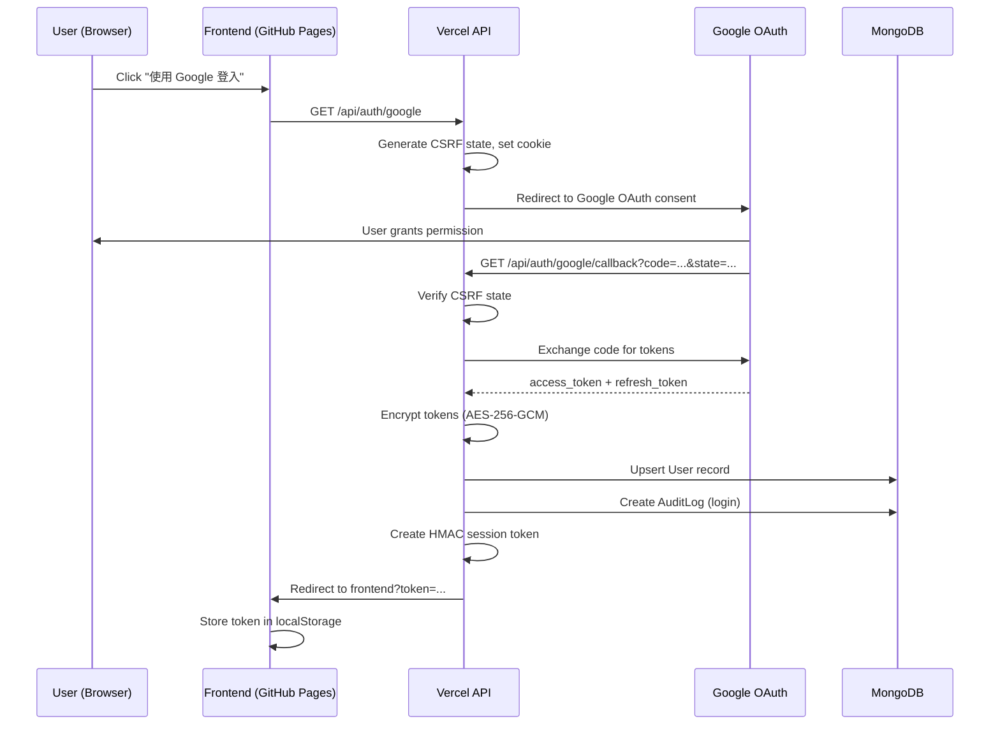
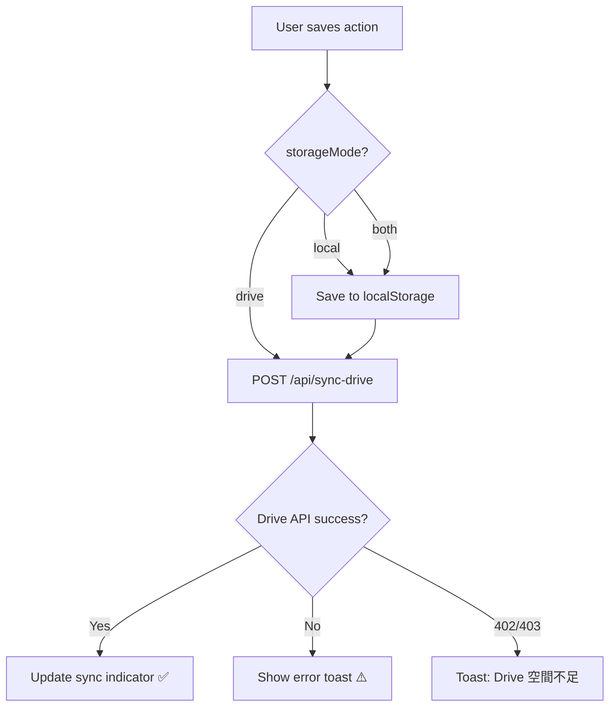
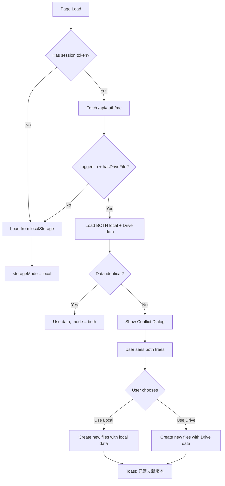
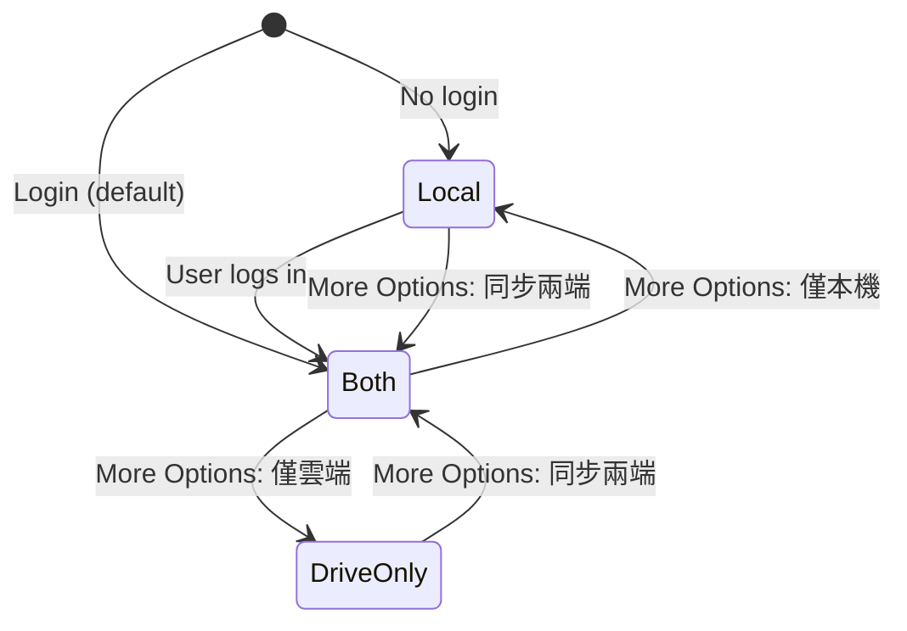

# 🛠️ Developer Documentation

## Project Structure

```
exam/
├── docs/
│   └── index.html              # Frontend SPA (GitHub Pages)
├── api/
│   ├── auth/
│   │   ├── google.js           # OAuth: redirect to Google
│   │   ├── google/callback.js  # OAuth: handle callback, create session
│   │   ├── me.js               # GET current user info
│   │   └── logout.js           # POST logout, clear session
│   ├── _lib/                   # (底線開頭避開 Vercel API 數量限制)
│   │   ├── cors.js             # CORS middleware
│   │   ├── crypto.js           # AES-256-GCM encrypt/decrypt
│   │   ├── db.js               # MongoDB connection + schemas
│   │   └── session.js          # HMAC session create/verify/clear
│   ├── browse-drive.js         # GET/POST list folders/files and load file by ID
│   ├── create-drive-file.js    # POST create new JSON on Drive
│   ├── load-from-drive.js      # GET read tree data from Drive
│   ├── set-drive-file.js       # POST set Drive file ID for user
│   └── sync-drive.js           # POST write tree data to Drive
├── vercel.json                 # Vercel routing & headers
├── package.json
├── README.md
└── DEVELOP.md                  # (this file)
```

---

## Flowcharts

### 1. Google OAuth Login Flow



### 2. Data Sync Flow



### 3. Page Load & Conflict Resolution



### 4. More Options Storage Modes



---

## API Reference

### Authentication

| Method | Endpoint | Description |
|--------|----------|-------------|
| GET | `/api/auth/google` | Initiate OAuth flow |
| GET | `/api/auth/google/callback` | OAuth callback handler |
| GET | `/api/auth/me` | Get current user (requires Bearer token) |
| POST | `/api/auth/logout` | Logout + audit log |

### Google Drive

| Method | Endpoint | Body | Description |
|--------|----------|------|-------------|
| POST | `/api/create-drive-file` | `{ fileName, folderName }` | Create new JSON file on Drive |
| GET / POST | `/api/browse-drive` | `?action=folders` or `{ action: 'load', fileId }` | Consolidated endpoint for custom Drive Picker UI (lists folders, files, or loads by ID) |
| POST | `/api/set-drive-file` | `{ fileId }` | Set existing file as sync target |
| POST | `/api/sync-drive` | `{ treeData, triggerAction }` | Write tree data to Drive |
| GET | `/api/load-from-drive` | — | Read tree data from Drive |

---

## Data Models

### User (MongoDB)

```js
{
  googleId: String,        // unique
  email: String,
  name: String,
  picture: String,
  encryptedAccessToken: {  // AES-256-GCM
    iv: String,
    authTag: String,
    encrypted: String
  },
  encryptedRefreshToken: Object,
  driveFileId: String,     // Google Drive file ID
  driveFileName: String,
  driveFolderName: String, // Google Drive parent folder path
  createdAt: Date,
  updatedAt: Date
}
```

### AuditLog (MongoDB)

```js
{
  userId: String,
  action: String,    // 'login' | 'logout' | 'sync_drive' | 'load_drive' | 'set_file' | 'create_drive_file'
  fileId: String,
  timestamp: Date,
  ip: String,
  status: String,    // 'success' | 'error'
  errorMessage: String
}
```

### Tree Data (JSON)

```js
{
  name: "human",
  children: [
    {
      id: "demand_xxx",
      name: "紓解工作壓力",
      actions: [
        {
          id: "action_xxx",
          name: "抽菸",
          cp: 7.0,       // final CP = st + lt * 0.1
          st: 15,        // short-term total
          lt: -80,       // long-term total
          isNew: false,
          tokens: [
            { id: "token_xxx", name: "多巴胺", score: 10, timeType: "st", stage: "reward" }
          ]
        }
      ]
    }
  ]
}
```

---

## Security Notes

1. **Never expose tokens**: OAuth access/refresh tokens are encrypted at rest and only decrypted server-side in memory
2. **Minimal scope (`drive.file`)**: 
   - Restricts access to app-created or user-selected files only. 
   - **Folder Visibility**: Because of this scope, the app's custom Google Drive Folder/File Picker can **ONLY** see folders and files that were created by the app itself. It cannot see or read the user's personal Google Drive folders created outside the app.
3. **CSRF**: OAuth state parameter verified in callback
4. **Session**: HMAC-SHA256 signed, 7-day expiry, no server-side session store needed
5. **CORS**: Whitelisted to `FRONTEND_URL` origin + localhost
6. **File restrictions**: Only `.json` files allowed, structure validated, 5MB max size
7. **Audit trail**: Every operation logged with IP, timestamp, and status
