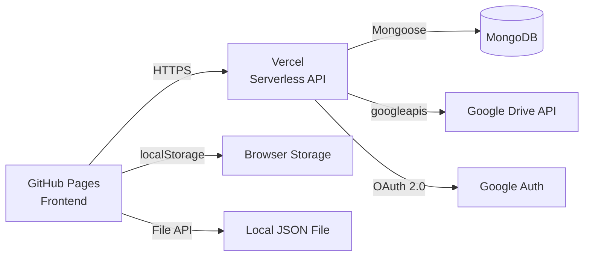

# 🧠 大腦重塑系統 — Brain Behavior Tree

> 基於《原子習慣》理論的互動式行為決策樹系統，幫助使用者分析習慣的短期 / 長期性價比（CP 值），並透過大腦的「最小阻力法則」找出改變行為的關鍵槓桿點。

**pro user**: [https://penter405.github.io/addiction/](https://penter405.github.io/addiction/)

**beginner user**: [https://penter405.github.io/addiction/old.html](https://penter405.github.io/addiction/old.html)

---

## ✨ Features

| Feature | Description |
|---------|-------------|
| 🌳 **行為決策樹** | 無邊界畫布，視覺化呈現 Human → Demand → Action 的樹狀結構 |
| 📊 **四階段 CP 編輯器** | 提示 → 渴望 → 回應 → 獎賞，拖曳 CP 物件到各階段 |
| 🛡️ **系統防護機制** | 好習慣短期 CP 必須 > 0、壞習慣短期 CP 必須 < 0 |
| 🔐 **Google OAuth 2.0** | 安全登入，token 以 AES-256-GCM 加密存於 MongoDB |
| ☁️ **Google Drive 同步** | 內建自訂的 Drive Picker（支援選取資料夾與檔案），行為樹自動同步至 JSON 檔案 |
| 💾 **本機儲存** | localStorage + 本機檔案匯出入，即使雲端全壞資料仍安全 |
| 📋 **稽核日誌** | 所有操作（登入、登出、同步）紀錄於 MongoDB AuditLog |

---

## 🏗️ Architecture


```mermaid
graph LR
    A[GitHub Pages<br>Frontend] -->|HTTPS| B[Vercel<br>Serverless API]
    B -->|Mongoose| C[(MongoDB)]
    B -->|googleapis| D[Google Drive API]
    B -->|OAuth 2.0| E[Google Auth]
    A -->|localStorage| F[Browser Storage]
    A -->|File API| G[Local JSON File]
```

**Frontend** (`docs/index.html`) — 純 HTML/CSS/JS 單頁應用，部署於 GitHub Pages  
**Backend** (`api/`) — Vercel Serverless Functions (Node.js)。注意：為避開 Hobby 方案 12 個無伺服器函式的限制，共用模組放在 `api/_lib/` 目錄（Vercel 會忽略底線開頭的檔案），並將多個 Drive API 端點整合至 `browse-drive.js`。  
**Database** — MongoDB Atlas（使用者資訊、加密 token、稽核日誌）  
**Cloud Storage** — Google Drive（使用 `drive.file` 最小權限範圍）

---

## 🔧 Tech Stack

- **Frontend**: Vanilla HTML / CSS / JavaScript
- **Backend**: Node.js (Vercel Serverless)
- **Auth**: Google OAuth 2.0 + HMAC-SHA256 Session Tokens
- **Encryption**: AES-256-GCM (for OAuth tokens at rest)
- **Database**: MongoDB + Mongoose
- **Cloud Sync**: Google Drive API v3
- **Deployment**: GitHub Pages (frontend) + Vercel (API)

---

## 🚀 Setup & Deployment

### Prerequisites
- Node.js ≥ 18
- MongoDB Atlas account
- Google Cloud Console project (OAuth 2.0 credentials)
- Vercel account
- GitHub repository with Pages enabled

### Environment Variables (Vercel)

| Variable | Description |
|----------|-------------|
| `GOOGLE_CLIENT_ID` | Google OAuth Client ID |
| `Client_secret` | Google OAuth Client Secret |
| `GOOGLE_REDIRECT_URI` | OAuth callback URL (e.g. `https://your-app.vercel.app/api/auth/google/callback`) |
| `MONGODB_URI` | MongoDB connection string |
| `SESSION_SECRET` | Random secret for HMAC session signing |
| `ENCRYPTION_KEY` | 64-char hex string (32 bytes) for AES-256-GCM |
| `FRONTEND_URL` | GitHub Pages URL (e.g. `https://user.github.io/repo/`) |

### Deploy

```bash
# 1. Clone
git clone https://github.com/Penter405/addiction.git
cd addiction

# 2. Install dependencies
npm install

# 3. Set environment variables on Vercel Dashboard

# 4. Deploy backend
vercel --prod

# 5. Frontend auto-deploys via GitHub Pages (docs/ folder)
```

---

## 🔒 Security Model

- **OAuth tokens** encrypted with AES-256-GCM before storing in MongoDB
- **Session tokens** signed with HMAC-SHA256, 7-day expiry
- **CSRF protection** via `state` parameter in OAuth flow
- **Minimal Drive scope**: `drive.file` — can only access files the app creates or user selects
- **File type restrictions**: Only `.json` files, validated structure, 5MB size limit
- **Audit logging**: Every login, logout, sync, and file operation recorded

---

## more detail

 [DEVELOP.md](https://github.com/Penter405/addiction/blob/main/DEVELOP.md)

---

## 📄 License

This project is for educational purposes.
---

## API Abuse Protection (New)

### Folder conflict algorithm (`POST /api/create-drive-file`)

- If `folderName` does not exist: create the folder automatically.
- If `folderName` already exists and no strategy is provided: API returns `409 folder_conflict` with existing folder list and choices.
- Client sends one of:
  - `folderConflictStrategy: "use_existing"` (optionally with `existingFolderId`)
  - `folderConflictStrategy: "create_new"` (API creates a unique name like `MyFolder (2)`).

### New anti-DDoS controls

- Per-endpoint rate limiting by IP + session/user (`api/_lib/security.js`)
- Burst protection (warm in-memory guard) before DB work
- Persistent abuse scoring + temporary blocking (MongoDB TTL-backed state)
- Optional bot challenge verification (`turnstile`, `recaptcha`, `hcaptcha`)
- Rate-limit headers on responses: `X-RateLimit-*`, `Retry-After`

### New environment variables

| Variable | Description |
|---|---|
| `RATE_SHORT_WINDOW_MS` | Short window size (default `10000`) |
| `RATE_LONG_WINDOW_MS` | Long window size (default `600000`) |
| `RATE_SHORT_LIMIT` | Default short-window request cap |
| `RATE_LONG_LIMIT` | Default long-window request cap |
| `RATE_BLOCK_MS` | Temporary block duration when abuse detected |
| `BOT_CHALLENGE_PROVIDER` | `turnstile` or `recaptcha` or `hcaptcha` |
| `TURNSTILE_SECRET_KEY` | Required when provider is `turnstile` |
| `RECAPTCHA_SECRET_KEY` | Required when provider is `recaptcha` |
| `HCAPTCHA_SECRET_KEY` | Required when provider is `hcaptcha` |

### Extra protection for `github pages -> vercel -> mongodb`

1. Enable Vercel WAF managed rules and Bot protection.
2. Put login + drive mutation paths (`/api/create-drive-file`, `/api/sync-drive`, `/api/set-drive-file`) behind stricter WAF rules.
3. Enable MongoDB IP access control to allow only Vercel egress where possible.
4. Add Vercel firewall rule for geo/ASN filtering if attacks are regional.
5. Alert on `429`, `403 challenge_required`, and sudden `AuditLog` spikes.